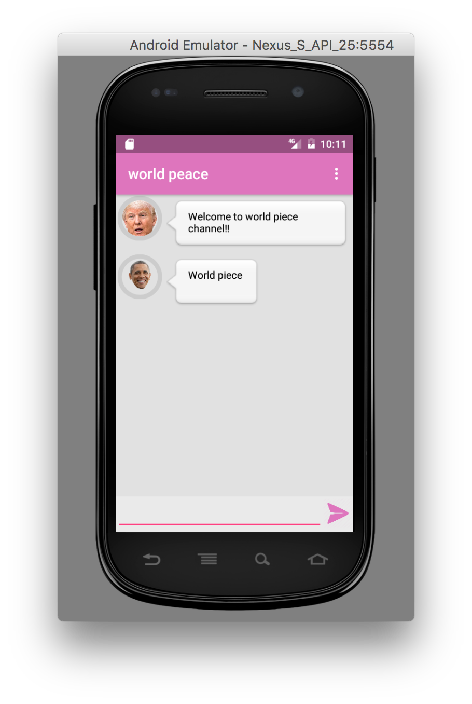

# chatti

Simple native android chat application with Node.js backend service, to test some modern frameworks :)

## setting up server

* clone repository
* open folder "chatserver"
* npm update
* node index.js (server should be now running at TCP port 3000)

## running mobile app

* clone repository
* open folder "chatapp" using Android Studio
* compile and run in Android virtual device
* login with "trump", password "password1", or "obama", password "password1"
* by default app connect to 10.0.2.2:3000, which points to localhost:3000 in Android virtual device (this is where Node.js is running by default)

